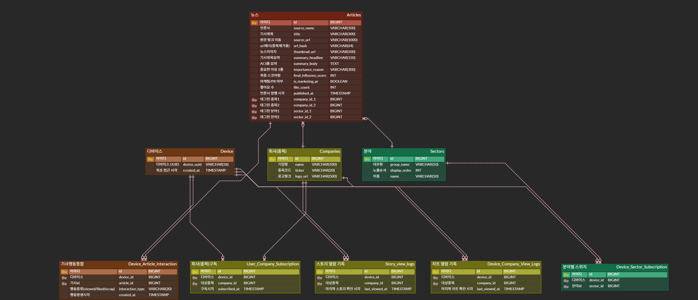

# 26s-w1-c3-04

## 공통과제 I : 웹 기반 프로젝트 (2인 1팀)

**목적:** 공통 과제를 함께 수행하며 웹 개발의 전체 흐름을 빠르게 익히고 협업에 적응하기

**결과물:** 기획부터 배포까지 완료된 웹 서비스와 관련 문서 일체

---

## 팀원

| 이름 | GitHub | 역할 |
|---|---|---|
| 김규민 | rbalskim |  |
| 정유진 | yujin923 |  |

---

## 기획안

> 프로젝트 주제, 목적, 핵심 기능, 예상 사용자, 팀원별 역할 등 정리

- **주제:** 개인 투자자를 위한 관심 종목 중심 경제 뉴스 요약 웹서비스
- **목적:** 
    * 긴 텍스트를 읽을 시간이 부족한 사용자들에게 "3줄 요약 + 한 줄 중요성" 이라는 압축된 형태의 정보를 제공하여 뉴스 소비 시간을 단축
    * 개인 투자자가 보유한 종목 구독을 통해 관련 뉴스를 선별적으로 전달
    * 분야별 카테고리를 통해 관심 투자 분야 핵심 기사 확인 기능 지원
    * 실시간 차트 연동을 통해 뉴스 요약과 동시에 차트를 확인 할 수 있는 직관적인 환경 제공
- **핵심 기능:** 
    1. 관심 종목 '스토리형' 알림 바: 구독한 기업의 뉴스가 새로 업데이트 되면 기업로고에 스토리형 알림 추가 
    2. 오늘의 pick: 당일 가장 중요한 주요 경제 뉴스를 선정하여 상단 배치 & 실시간 중요 기사 업데이트
    3. AI 3+1 요약: AI를 활용한 '뉴스 요악 3줄 + 이 기사가 중요한 이유 1줄'을 통해 직관적인 인사이트 제공
    4. 실시간 차트 연동: 관심 종목 뉴스 기사에서 실시간으로 확인 가능하도록 주가 차트 연동
    4. 키워드 카테고리별 필터링: 원하는 카테고리로 뉴스 요약을 필터링함으로써 원하는 분야 선택 가능
    5. 사용자 맞춤형 추천: 좋아요 기능을 통해 학습된 사용자가 선호하는 카테고리의 뉴스를 홈화면에 우선 노출
    6. 스크랩 기능: 스크랩을 통해 관심 기사를 나의 스크랩 탭에 아카이빙
- **예상 사용자:** 
    * 주식 투자를 막 시작해 어떤 뉴스를 봐야 할지 모르는 초보 투자자
    * 출퇴근, 통학 시간 등 자투리 시간을 활용해 오늘 시장의 핵심 이슈만 빠르게 훑어보고 싶은 분

---

## 기능 명세서
> 구현할 기능을 사용자 관점에서 정리하고, 필수 기능과 선택 기능을 구분

### 필수 기능

1. 뉴스 자동 수집 및 요약
- [ ] 언론사 RSS 기반 실시간 기사 수집 (10~15분 주기)
- [ ] URL 해시 기반 중복 기사 제거
- [ ] 시장/기업 영향력 단일 스코어링 (실적/재무, 지배구조/경영권, 계약/수주, 리스크, 자본변동, 시장반응 6개 카테고리 기준, 마케팅·PR·이벤트성 기사는 낮은 점수)
- [ ] 임계값 동적 하향 (7점 시작 → 소진 시 6점, 5점까지 하향 / 5점 밑 구간은 노출 안 함)
- [ ] 바닥까지 내려도 새 기사가 없으면 안내 카드 표시
- [ ] LLM 기반 핵심 요약 생성 (헤드라인 + 3~4문장 + "중요한 이유" 한 줄)
  - "중요한 이유"는 왜 투자자가 알아야 하는지 맥락·인과관계만 설명, 방향성 예측(상승/하락, 긍정/부정 영향)은 절대 포함 금지
- [ ] 원문 링크(`source_url`) 데이터 필드 포함

2. 종목 및 분야 태깅
- [ ] 종목 태깅: 화이트리스트 매칭 + 판단 기준(헤드라인·리드문 등장 → 사건의 주체 여부 → 기사당 최대 2개)
- [ ] 분야 태깅: 대분류 9개 + 하위 세부분야, 기사당 최대 2개
- [ ] 카드에 종목/분야 태그 표시, 탭하면 즉시 구독 토글

3. 구독 시스템
- [ ] 회사 구독: 구독 추가 화면(검색)에서 추가/해제
- [ ] 분야 구독: 관심 분야 패널에서 대분류·세부분야 2단계 토글 (전체/부분선택 로직 포함)
- [ ] 카드의 태그를 눌러 그 자리에서 바로 구독 추가/해제

4. 홈
- [ ] 좌측 상단 버튼 → 관심 분야 패널 오픈
- [ ] 구독 기업 스토리 아바타 레일 (안 읽음=빨간 테두리, 확인함=회색 테두리)
- [ ] `+` 아바타 → 구독 추가 화면
- [ ] 요약 카드 2개 (지수 / 관심 기업, 등락률 + 스파크라인)
- [ ] "오늘의 주요 뉴스" 헤드라인 리스트, 탭하면 숏츠로 이동

5. 숏츠 (세로 풀스크린 스와이프 피드, 하단 탭 유지)
- [ ] 좌측 상단 버튼 → 관심 분야 패널 오픈
- [ ] 스토리 경유 진입 시 기업 컨텍스트 헤더 표시
- [ ] 카드: 이미지, 헤드라인(옆에 외부 링크 아이콘, 탭하면 원문 기사로 이동), 태그, 요약, "중요한 이유", 우측 세로 액션 아이콘(좋아요/스크랩/공유), 출처·시간
  - 헤드라인 탭 영역과 하단 태그 탭 영역 사이 충분한 여백 확보 (오터치 방지)
  - 원문은 새 탭/인앱 브라우저로 열리며, 숏츠 피드 상태는 유지(뒤로가기 시 원래 카드로 복귀)
- [ ] 세로 드래그로 카드 전환, 당겨서 새로고침
- [ ] 좌우 스와이프 → 하단 탭 순서대로 전환 (종목 태깅 카드는 차트 탭 이동 시 해당 종목 자동 선택)

6. 차트
- [ ] 좌측 상단 버튼 → 기업 선택 패널 (검색 + 최근 본 항목 + 구독 중인 기업)
- [ ] 태깅 1개 → 단일 상세: 종목명·현재가·등락률, 일/주/월 토글, 가격 차트 + 거래량 차트
- [ ] 태깅 2개 → 복합 뷰: 두 종목 카드 병렬 배치, 종목명 탭 시 단일 상세로 전환
- [ ] 진입 시 태깅 종목 전부 "최근 본 항목" 최상단에 동시 추가

7. 스크랩
- [ ] 저장한 숏츠 목록 (썸네일, 태그, 헤드라인)
- [ ] 항목 탭 → 숏츠에서 해당 카드로 이동
- [ ] (로그인 없을 시) 세션 기반 임시 저장 — 로그인 기능 추가 시 계정에 영구 귀속

### 선택 기능

1. 계정
- [ ] 로그인 화면 (이메일/비밀번호)
- [ ] 회원가입 화면
- [ ] 로그인 시 좋아요·스크랩이 세션이 아닌 사용자 계정에 영구 저장됨

2. 인기 콘텐츠 노출
- [ ] 홈 화면 "인기 뉴스" 섹션: 좋아요 많은 순 TOP 5, 탭하면 숏츠에서 해당 뉴스로 이동
- [ ] 구독 추가 화면 하단 "인기 검색 기업" TOP 5 (전체 사용자 검색·구독 빈도 기준)

---

## IA 및 화면 설계서

> 서비스의 전체 페이지 구조와 페이지 간 이동 흐름; 각 페이지의 주요 UI 구성, 입력 요소, 버튼, 사용자 행동 흐름 등을 간단한 와이어프레임 형태로 정리

<!-- Figma 링크 또는 이미지 첨부 -->


https://www.figma.com/design/Vq5QMbXViqNAHOJi2ChqVa/Stockshorts?node-id=0-1&p=f&t=7F5aSTpdKktPQ0Mu-0

---

## DB 스키마

> 필요한 테이블, 주요 필드, 데이터 타입, 테이블 간 관계를 정리

<!-- ERD 이미지 또는 테이블 정의 -->

---

## API 문서

> API 주소, 요청 방식, 요청값, 응답값, 에러 상황을 정리

| Method | Endpoint | 설명 | 요청 | 응답 |
|---|---|---|---|---|
|  |  |  |  |  |

---

## 배포 결과물

> 접속 가능한 링크, 실행 방법, 주요 구현 내용

- **서비스 URL:**
- **실행 방법:**

```bash
# 실행 방법 작성
```

---

## 회고 문서

> 개발 과정에서의 어려움, 해결 방법, 역할 분담, 다음에 개선할 점 (KPT 방법론 참고)

### Keep

### Problem

### Try

---

## 참고 자료

- [SDD(스펙 주도 개발) 이해하기](https://news.hada.io/topic?id=21338)
- [Software Design Document Best Practices](https://www.atlassian.com/work-management/project-management/design-document)
- [IA 정보구조도 작성 방법](https://brunch.co.kr/@nyonyo/7)
- [기획자 화면설계서 작성법](https://brunch.co.kr/@soup/10)
- [Figma 와이어프레임 가이드](https://www.figma.com/ko-kr/resource-library/what-is-wireframing/)
- [무료 Figma 와이어프레임 키트](https://www.figma.com/ko-kr/templates/wireframe-kits/)
- [ERD/DB 설계 총정리](https://inpa.tistory.com/entry/DB-%F0%9F%93%9A-%EB%8D%B0%EC%9D%B4%ED%84%B0-%EB%AA%A8%EB%8D%B8%EB%A7%81-%EA%B0%9C%EB%85%90-ERD-%EB%8B%A4%EC%9D%B4%EC%96%B4%EA%B7%B8%EB%9E%A8)
- [API 명세서 작성 가이드라인](https://velog.io/@sebinChu/BackEnd-API-%EB%AA%85%EC%84%B8%EC%84%9C-%EC%9E%91%EC%84%B1-%EA%B0%80%EC%9D%B4%EB%93%9C-%EB%9D%BC%EC%9D%B8)
- [좋은 README 작성하는 방법](https://velog.io/@sabo/good-readme)
- [단기 프로젝트 회고 KPT 방법론](https://velog.io/@habwa/%EB%8B%A8%EA%B8%B0-%ED%94%84%EB%A1%9C%EC%A0%9D%ED%8A%B8-%ED%9A%8C%EA%B3%A0-KPT-%EB%B0%A9%EB%B2%95%EB%A1%A0)
